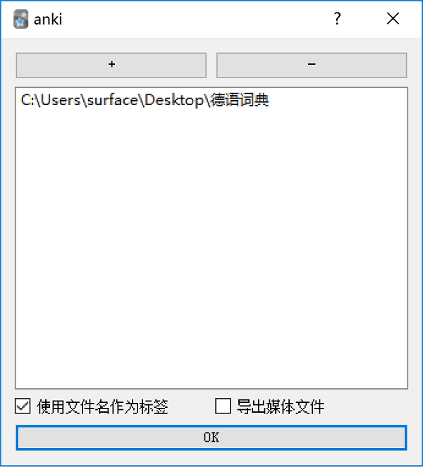
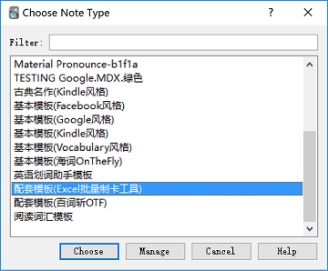
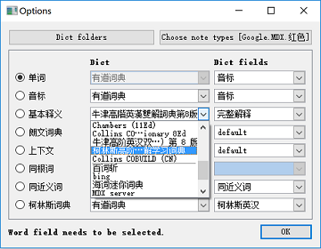
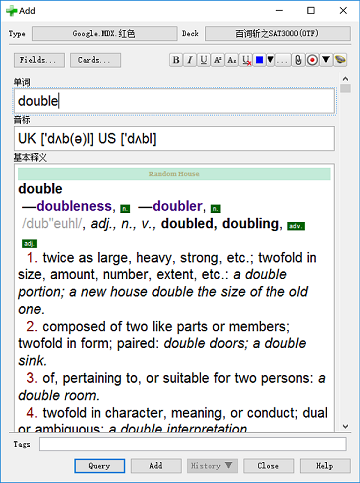
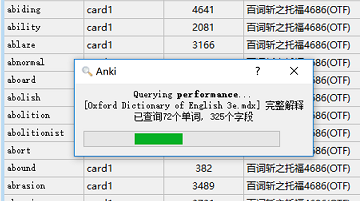

# WordQuery Addon for Anki

[中文说明](README-CN.md)

## Main Features

This addon is developed to emancipate you from the tedious work of looking up words in dictionary and pasting the explanations to anki.

**Querying Words and Making Cards, IMMEDIATELY!**

**Support querying in mdx and stardict dictionaries**

**Support querying in web dictionaries (having provided many ones, and more others need to be [customized](#customize))**

## Installation

1. Place "wordquery.py" and "wquery" folder in this repository in the anki add folder.    
**OR**
2. Use the installation code: 775418273

## How to Set

### Set Local Dictionaries

*If you do not use local dictionaries, you can skip this step.*

1. Click menu "Tool"->"WordQuery", popup the "Options" dialog

2. Click "Dict folders" button, add or remove the dictionary folders (support recursive searching)

    

   - "Use filename as dict label"
   - "Export media files" indicates if the audios will be exported.


### Set Note Type

In the "Options" dialog, click "Choose note type" and set the note type you want to use.




### Set the word field

Click the radio button to set the word field you want to query.


### Set the mappings from note fields to dictionary explanations



The "Dict" comoboxes are used to specify the dictionaries.

The "Dict fields" comoboxes are used to specify the available dictionary fields.

## How to Use

### "Add" dialog   

Once the word to query is ready, click "Query" button or popup the context menu and use relevant commands.

* "Query" button  
Query the explanations for all the fields.
* “Query All Fields” menu  
Query the explanations for all the fields.
* "Query Current Field" menu  
Query the explanation for current focused field.



### "Browse" window   

Select single word or multiple words, click menu "WordQuery"->"Query selected".



All above query actions can be trigged also by the shortcut (default "Ctrl+Q"), but you could change it through the addon's "Edit" menu.  
```python
# shortcut
shortcut = 'Ctrl+Q'
```


## <a name="customize"></a>Service Customization

The advanced users can implement new web dictionary services. See [a typical reference](wquery/service/youdao.py) for the details.

### Inherit `WebService` class

```@register(label)``` is used to register the service, and parameter ```label``` as the dictionary name will be shown in the dictioary list.

```python
@register(u'有道词典')
class Youdao(WebService):
    """service implementation"""
```

### Define Dictionary Field

The field export function has to be decorated with ```@export(fld_name, order)```.

- para ```fld_name```: name of the dictionary field

- para ```order```: order of the field, the smaller number will be shown on the upper of the field list.

```python
@export(u'美式音标', 1)
def fld_phonetic_us(self):
    return self._get_field('phonitic_us')

@export(u'英式音标', 2)
def fld_phonetic_uk(self):
    return self._get_field('phonitic_uk')
```

### Decorating the Field (optional)

Using ```@with_style(**kwargs)``` to specify the css style strings or files, javascript strings or files, whether wrapping the css to avoid latent style interference.

```python
@with_styles(cssfile='_youdao.css', need_wrap_css=True, wrap_class='youdao')
def _get_singledict(self, single_dict, lang='eng'):
    url = "http://m.youdao.com/singledict?q=%s&dict=%s&le=%s&more=false" % (
        self.word, single_dict, lang)
    try:
        return urllib2.urlopen(url, timeout=5).read()
    except:
        return ''
```


## Other Projects Used

- [mdict-query](https://github.com/mmjang/mdict-query)
- [pystardict](https://github.com/lig/pystardict)

