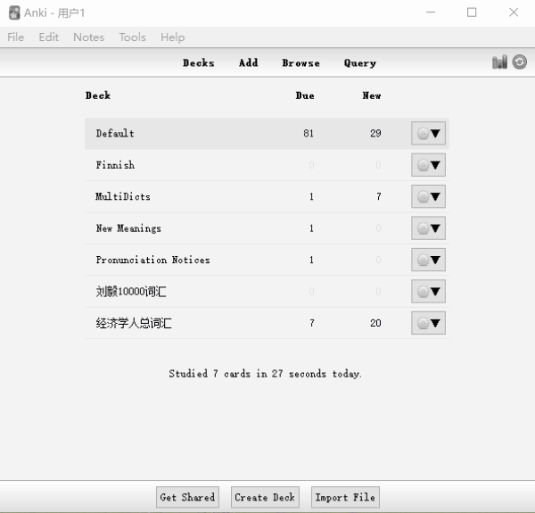
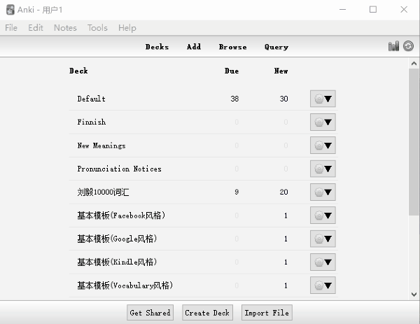

# WordQuery 插件(anki)

## 主要功能

1. 快速零散制卡      

    在添加卡片界面，输入单词，可直接获取详细释义，并自动填充各字段，实现快速制卡。   

2. 批量制卡  

    批量导入单词表，自动获取单词释义并添加卡片。

## 安装
     
1. 插件安装

   - [https://github.com/finalion/anki](https://github.com/finalion/anki)下载并放到anki插件文件夹
   - 或者使用代码775418273安装
    
2. MultiDicts模板导入

    目前模板支持词典：
    - Collins COBUILD中文
    - Collins COBUILD英文
    - Oxford Dictionary of English 3e
    - 牛津高阶词典第8版
    - Merriam-Webster's Collegiate Dictionary and Thesaurus, 2015
    - MacmillanEnEn
    - Longman Contemporary English 6th

## 使用

1. “工具”菜单-->"Word Query"，设置mdx字典地址。
     - 设置mdx文件所在的路径。
     - 设置mdx server的地址。mdx server部署方式：
          - [你家老黄](https://ninja33.github.io/) 发布的MDX server
          - [mmjang](https://github.com/mmjang/mdict-query)发布的mdict-query

    以上两个选项
      - 选择两个：获取两个地址词典的释义，在线获取简单释义
      - 选择一个：获取一个地址词典的释义，在线获取简单释义
      - 不选择：只在线获取简单释义

2. 添加单词卡片  
 
   在添加卡片界面，第一个文本框输入单词后，按下“Query”按钮或者使用“Ctrl+Q”快捷键，可从设置的字典中获取释义。

3. 批量导入单词表   

    “文件”菜单-->"Batch Import..."，根据提示，依次选择单词列表文件，选择插入的记忆库，选择笔记类型，自动查询并添加卡片。

    批量导入功能，默认不开启在线获取释义，如果需要打开，请自行修改插件代码：enable_youdao = 0

## 感谢
- 模板在[你家老黄](https://ninja33.github.io/)基础上修改
- mdx解析工具由[mmjang](https://github.com/mmjang/mdict-query)提供

