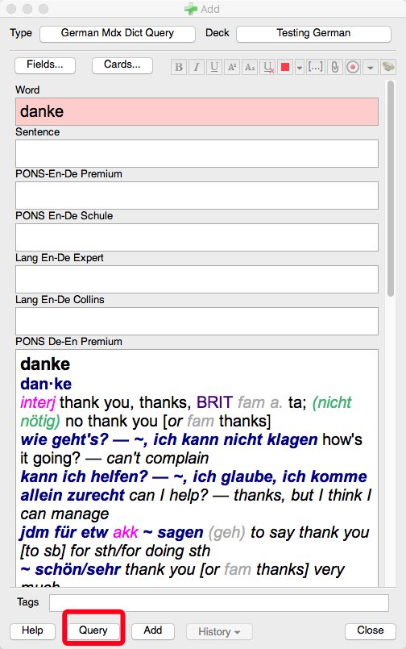
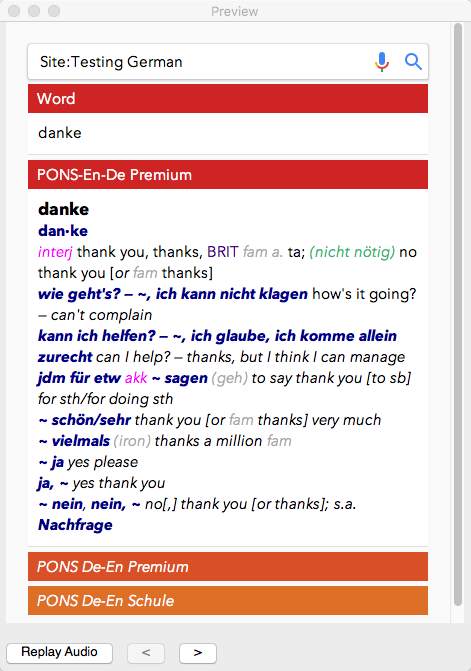

# Query Introduction

Query’s ultimate goal  is to free Anki users from tedious works of  manually copy/pasting dictionary definitions whenever new language-learning cards are to be made.It supports most mdict dictionary files, from which word definitions can be added  to designated card fields. 

New features are spot-on useful  and now it can run multiple .mdx dictionaries simultaneously, providing more definition reviewing options.Query also supports updating your old cards of any given deck, complementing the add-on eco-system.
Last not but least, with the templates provided with toggle functions, cards  display can be concise and elegant on the eye, yet sacrificing not the richness of its content.

New Features (Nov. 26th. 2016)

1. Supports loading multiple .mdx dictionaries simultaneously.
2. Supports “Query” to  old cards of any given deck, with “word” field provided. 

User How-to

1. Install the add-on
2. Mdx dictionaries are available online and this add-on can’t provide any due to potential copyright infringement.
3. On the main Tools menu, choose Query and set paths for designated .mdx dictionaries to template fields accordingly. 
4. Upon adding a new card, type the word and press “Query” button, and voila it’s done.

User Wiki

1. What is a .mdx dictionary?

	See [https://en.wikipedia.org/wiki/GoldenDict](https://en.wikipedia.org/wiki/GoldenDict)

2. Where can I find such .mdx dictionaries?

	Go google it. For Chinese users, can go to dictionary forums like pdawiki and you may find what you want.

Thanks 

1. [https://ninja33.github.io](https://ninja33.github.io)
2. [https://github.com/mmjang/mdict-query](https://github.com/mmjang/mdict-query)

